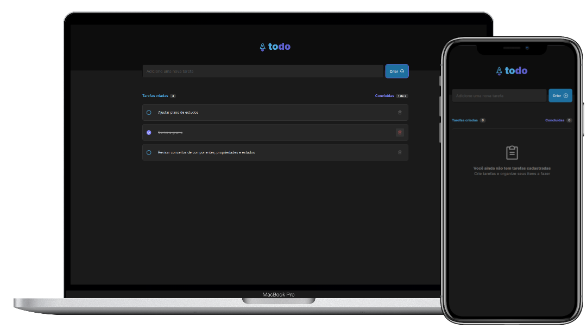

<p>
    <h1 align="center">
        
        <br>

<a href="https://www.linkedin.com/in/omarcoaur3lio/">
    
</a>

<a aria-label="Completed" href="https://rocketseat.com.br/">
    </img>
</a>

<a href="./README.md">
    
</a>
    </h1>
</p>
<br>

## :speech_balloon: About
This project was developed as a challenge from module one of the Ignite training program at [Rocketseat](www.rocketseat.com.br).
<br>
In this application it is possible to add and remove tasks to be performed, as well as mark them as completed. The main objective of this challenge was to solidify the concepts of component, state and property of the `ReactJS`.

## :camera: Preview 
<div align="center">
  
</div>

## :hammer_and_wrench: Utilization
To run the project it is necessary to have the [Git](https://git-scm.com/book/pt-br/v2/Come%C3%A7ando-Instalando-o-Git) and the [NodeJS](https://nodejs.org/pt-br/download/package-manager/) installed on your PC.

1. Clone this repo
```shell
git clone https://github.com/omarcoaur3lio/ignite-todo.git
```    

2. Navigate to the created directory
```shell
cd ignite-todo
```

3. Install project dependencies
```shell
yarn # or npm i
```

4. Run the app
```shell
yarn dev # or npm run dev
```

## :rocket: Technologies used

- [Vite](https://vitejs.dev/)
- [ReactJS](https://reactjs.org/)
- [TypeScript](https://www.typescriptlang.org/)
- [Phosphor Icons](https://phosphoricons.com/)

<p align="center">
Made with :purple_heart:
</p>
